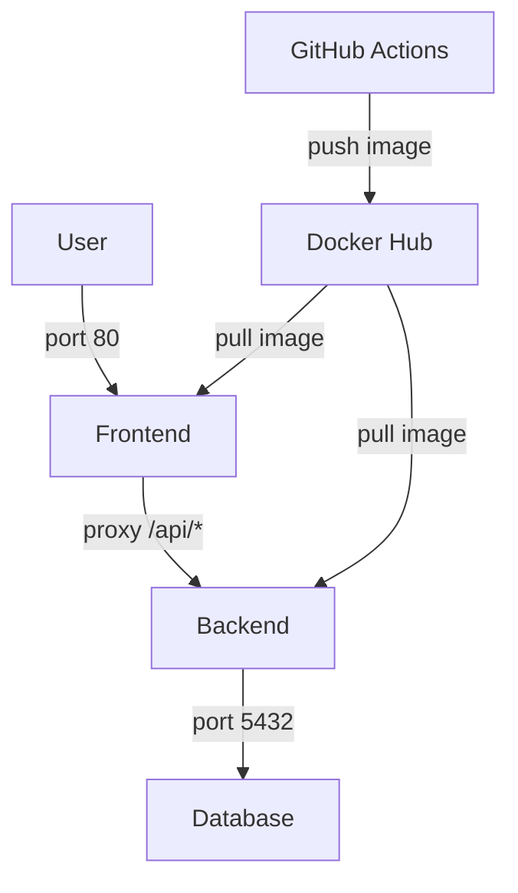

# VitalSync

Application de suivi médical et sportif composée d'un back-end Node.js, d'un front-end Nginx et d'une base de données PostgreSQL.

## Architecture



## Prérequis

- Docker >= 24
- Docker Compose >= 2
- Git >= 2.40
- Node.js 20 (uniquement pour le développement local)

## Lancer l'application

Copier le fichier d'environnement et renseigner les valeurs :
```bash
cp .env.example .env
```

Démarrer les 3 services :
```bash
docker compose up -d
```

- Front-end : http://localhost:80
- Back-end API : http://localhost:3000
- Health check : http://localhost:3000/health

Arrêter les services :
```bash
docker compose down
```

## Pipeline CI/CD

La pipeline GitHub Actions se déclenche sur chaque push sur `develop` et sur chaque Pull Request vers `main`. Elle comporte 3 étapes séquentielles :

1. **Lint & Tests** : vérifie la qualité du code avec ESLint et exécute les tests Jest
2. **Build & Push** : construit les images Docker et les pousse sur Docker Hub avec le SHA du commit comme tag
3. **Deploy Staging** : démarre les conteneurs avec Docker Compose et vérifie que le back-end répond sur `/health`

## Choix techniques

| Outil | Justification |
|---|---|
| Node.js 20 | Version LTS stable |
| PostgreSQL 16 | Base de données relationnelle robuste et open source |
| Docker multi-stage | Réduit la taille de l'image finale en excluant les outils de dev |
| GitHub Actions | Intégré nativement à GitHub, pas de configuration externe nécessaire |
| Docker Hub | Registry public simple d'utilisation, proposé dans le sujet |
| nginx:alpine | Image minimaliste (~25MB) suffisante pour servir des fichiers statiques |
